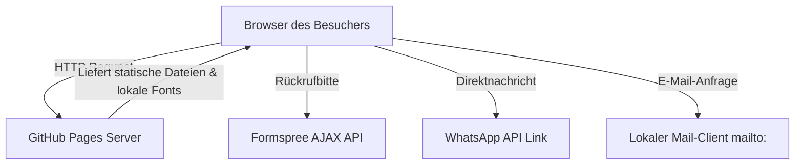

# Codebase-Architektur & UX-System — Lassak Digital

Dieses Dokument beschreibt die Architektur, das UX-System und die Struktur der Codebase von `lassakdigital.de`.

## 1. Systemübersicht & Stack

Die Website ist als performante, statische Landingpage konzipiert und verwendet keine Frameworks oder Build-Systeme, um eine maximale Ladegeschwindigkeit und Wartbarkeit zu gewährleisten.

### Technologie-Stack
- **Frontend-Kern**: Semantisches HTML5.
- **Styling**: CSS3 (Vanilla CSS) mit systemweiten CSS-Variablen. Kein CSS-Präprozessor oder Tailwind.
- **Interaktionen**: Vanilla JavaScript (ES6+), direkt in den HTML-Dokumenten als `<script>` eingebunden.
- **Hosting**: GitHub Pages (statisches Serving).
- **DNS-Routing**: Namecheap CNAME und Apex A-Records.

### Ordnerstruktur
```text
/
├── .git/               # Git-Versionsverwaltung
├── .nojekyll           # Deaktiviert Jekyll-Processing auf GitHub Pages
├── AGENTS.md           # Konventionsregeln für KI-Entwickler
├── CLAUDE.md           # Einstiegspunkt für KI-Entwickler (verweist auf AGENTS.md)
├── CNAME               # Domain-Mapping für GitHub Pages (www.lassakdigital.de)
├── CHANGELOG.md        # Manuelles Projekt-Changelog
├── index.html          # Startseite & Haupt-Landingpage
├── impressum.html      # Rechtlich erforderliches Impressum
├── datenschutz.html    # Rechtlich erforderliche Datenschutzerklärung
├── style.css           # Zentrales Stylesheet (Layout, Design-System, Animationen)
├── logo.png            # Unbenutzte Logo-Ressource im Root
├── docs/               # Technische Projektdokumentation
│   ├── README.md       # Übersicht der Dokumente
│   ├── architecture.md # Dieses Dokument (Architektur & UX)
│   ├── deployment.md   # Deployment- & DNS-Konfigurationsleitfaden
│   ├── CONVENTIONS.md  # Codierungs- und Interaktionsrichtlinien
│   ├── DATA-MODEL.md   # Dokumentation des (nicht vorhandenen) Datenmodells
│   ├── API-SURFACE.md  # Beschreibung der Schnittstellen & Integrationen
│   ├── DECISIONS.md    # Dokumentation von Architekturentscheidungen (ADR)
│   ├── DEPENDENCIES.md # Externe Ressourcen und Lizenzen
│   ├── GLOSSARY.md     # Glossar der Domänen-Fachbegriffe
│   ├── CHANGELOG-AI.md # Protokoll der KI-Änderungen
│   └── audit/          # Ergebnisse des System-Audits
│       ├── AUDIT.md    # Befundbericht
│       ├── FIX-PLAN.md # Korrekturmaßnahmenplan
│       └── AUDIT-IGNORE.md # Ignorierte Befunde
└── images/             # Bild- und Vektorressourcen
    ├── logo_lassakdigital-black.svg
    └── logo_lassakdigital-white.svg
```

---

## 2. Design-System & Typografie

Das Design-System ist in `style.css` über CSS Custom Properties definiert. Es implementiert ein hochwertiges, kaufmännisch-seriöses Light-Theme ("Ivory, Gold & Ink") mit warmem Ivory-Beige-Hintergrund, dunkler Ink-Schrift und edlen Gold-Akzenten (inspiriert von aiscwork.com).

### Farbpalette
- **Hintergrund**: `--bg-primary` (`#fcfaf6`) sorgt für ein einladendes, warmes Elfenbein-Fundament.
- **Card- und Hilfshintergründe**: `--bg-secondary` (`#f3f1ee`) heben Inhaltsbereiche durch ein dezentes Warm-Beige ab; `--bg-card` (`#ffffff`) wird für weiße Inhaltskarten verwendet.
- **Textfarben**: `--text-primary` (`#0e1217`) für eine klare Hierarchie der Überschriften in Ink-Schwarz; `--text-secondary` (`#5f6469`) für angenehm lesbaren, dunklen Fließtext.
- **Akzente**: Edles Gold (`--accent`: `#cf9a4a`) dient als primärer Interaktions-Indikator, mit dunklerem Gold (`--accent-hover`: `#b07e38`) für Button-Hovers und einem transluzenten Gold-Beige (`--accent-glow`: `rgba(207, 154, 74, 0.35)`) für weiche Glühschatten.

### Typografie
- Die gesamte Website verwendet die Schriftart **Inter** (lokal gehostet zur DSGVO-Konformität).
- CSS-Variablen `--font-display` und `--font-body` verweisen beide auf `'Inter', sans-serif`, um ein einheitliches Schriftbild zu gewährleisten. Hierarchien werden ausschließlich über Font-Weights (300 bis 800) gesteuert.

---

## 3. Interaktions- & Animationsstandards

### Dynamischer Custom Cursor
Auf Desktop-Geräten (gefiltert via `@media (pointer: fine)`) wird der Standard-Mauszeiger des Systems ausgeblendet (`cursor: none`) und durch zwei CSS-Elemente ersetzt:
- **Dot Cursor (`.cursor`)**: Folgt den Mauskoordinaten ohne Verzögerung.
- **Ring Cursor (`.cursor-ring`)**: Folgt der Mausposition verzögert über einen Easing-Algorithmus in JS (`rx += (mx - rx) * 0.15`), was eine flüssige Bewegung erzeugt.
- **Hover-Effekte**: Beim Überfahren interaktiver Elemente (Links, Buttons) vergrößert sich der Ring und wechselt die Farbe zu einem edlen Gold (`rgba(207, 154, 74, 0.7)`).

### Scroll-Reveal-Animation
Elemente mit der Klasse `.reveal` werden ausgeblendet (`opacity: 0; transform: translateY(30px)`). 
- Ein `IntersectionObserver` in JavaScript überwacht das Scrollverhalten.
- Sobald ein Element zu 10 % sichtbar ist, erhält es die Klasse `.visible`, was eine sanfte CSS-Transition triggert.
- Transition-Timing: `cubic-bezier(0.16, 1, 0.3, 1)` (für einen elastischen Übergang).

### Scroll-Down-Pfeil-Animation
Am unteren Rand des Hero-Bereichs (Above the Fold) befindet sich ein nach unten zeigender Interaktions-Pfeil (`.hero-scroll-btn`).
- **Animation**: Der Pfeil führt eine kontinuierliche, vertikale Schweb-Animation (`arrowBounce`) via CSS `@keyframes` aus (`translateY(0)` bis `translateY(10px)`).
- **Smooth Scroll**: Beim Klick auf den Pfeil scrollt die Seite mittels nativem CSS-Verhalten (`scroll-behavior: smooth`) sanft zur nachfolgenden Sektion (`#approach`).
- **Custom Cursor Integration**: Da der Pfeil als `<a>`-Link implementiert ist, greift die Hover-Erkennung des dynamischen Cursors. Bei Mausberührung skaliert der `.cursor-ring` auf 48px und färbt sich gold (`rgba(207, 154, 74, 0.7)`).

---

## 4. Navigations-System & Diskrepanzen

### Navigations-Struktur
Die Navigation ist als schwebende, glassmorphische Menüleiste ("Floating Menu") über `position: fixed` direkt über dem Inhalt positioniert. Dadurch fängt die Hero-Sektion mit ihrem radialen Verlauf und dem Punktraster direkt am oberen Bildschirmrand an und verläuft nahtlos hinter der schwebenden Navigation.
- **Desktop (>= 1024px)**: Zentrierte, schwebende Menüleiste (max-width: 1200px, zentriert via `left: 50%` und `transform`) mit Abstand nach oben (20px), abgerundeten Ecken (20px), edlem weißen Glas-Effekt (`rgba(255, 255, 255, 0.75)` mit `backdrop-filter: blur(16px)`) für universelle Kompatibilität auf allen Seiten, sowie einer feinen Haarlinie (`border: 1px solid var(--border-color)`). Das Logo ist vergrößert (34px Höhe).
- **Mobil (< 1024px)**: Schwebende Menüleiste (28px Logohöhe) mit Abstand nach oben. Beim Klick auf das Hamburger-Menü-Icon dehnt sich die Navigation nahtlos auf volle Bildschirmbreite aus (`body.mobile-open nav` setzt `left: 0`, `transform: none` und `width: 100%`), wobei der Hintergrund transparent wird und ein vollflächiges Menü (`.nav-menu`) herunterfährt.

### Dokumentierte vs. Reale Funktionalität (Wichtiger Audit-Befund)
In früheren Versionen der Dokumentation (`architecture.md`) und im `CHANGELOG.md` (Version 1.1.0) wurden **Dropdown-Untermenüs** für Navigationspunkte wie `Leistungen`, `Case Studies` und `Preise` beschrieben. 

**Ist-Zustand des Codes**:
- Es sind **keine** Dropdown-Menüs im HTML (`index.html`) oder CSS (`style.css`) implementiert.
- Die Navigation besteht ausschließlich aus flachen Anker-Links (`#approach`, `#workflow`, `#contact`).
- Die Dokumentation der Dropdown-Mechaniken entspricht einem geplanten Zustand, der im Code (noch) nicht existiert.

---

## 5. Systemdatenfluss

Da es sich um eine rein statische Website handelt, gibt es keinen Backend-Datenfluss. Der Datenfluss beschränkt sich auf clientseitige Weiterleitungen und externe Integrationen:


